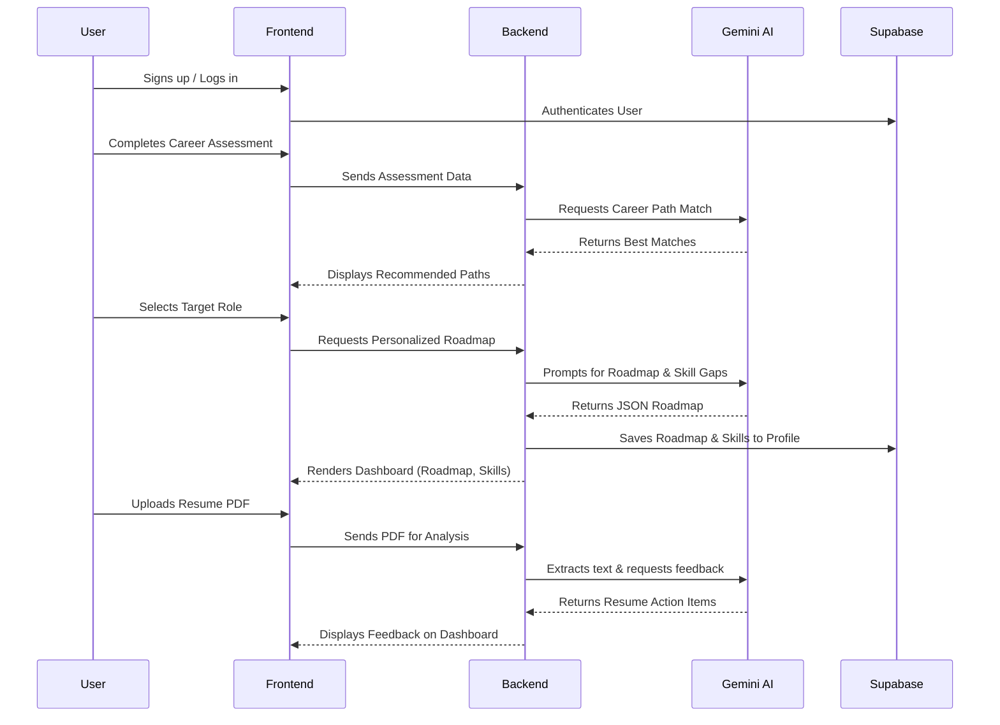
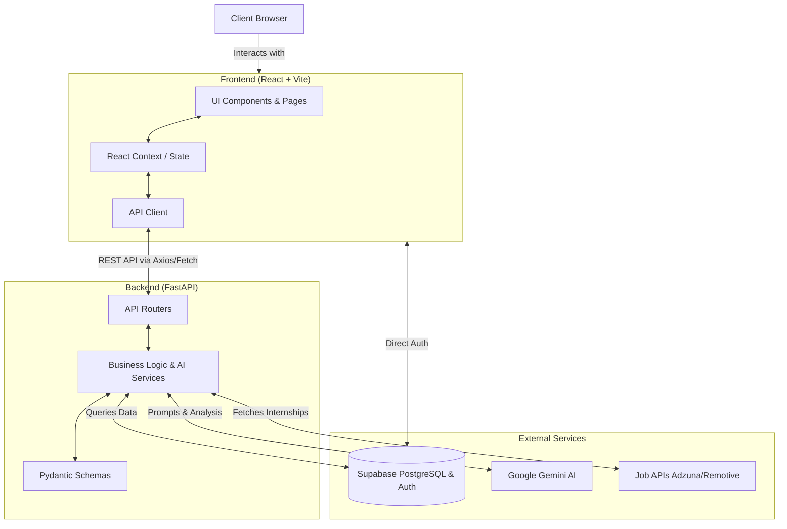

# CareerSpark 🚀

**CareerSpark** is a full-stack, AI-powered career intelligence platform designed specifically for students transitioning out of high school (Class 12). It provides an intuitive, highly personalized roadmap to bridge the gap between education and career readiness.

Built as part of the **Infosys Springboard Virtual Internship 7.0 — Batch 1**.

---

## 🌟 The Problem We Solve
Many students finish high school without a clear understanding of what career suits them, what skills to learn, or where to find entry-level internships. CareerSpark eliminates this confusion by offering a complete career path tailored to a student's strengths, interests, and existing skills, supported by artificial intelligence.

## ✨ Core Features

- **🧠 Career Assessment Engine:** An AI-powered multi-step questionnaire that evaluates your interests, strengths, and working style to recommend the top career paths.
- **🗺️ AI-Generated Roadmap:** Get a personalized step-by-step roadmap broken down into Foundation, Intermediate, and Job-Ready phases (Powered by Google Gemini AI).
- **🎯 Skill Gap Analyzer:** Compare your current skills against industry requirements to see exactly what you need to learn.
- **📜 Certifications & Courses Tracker:** Discover recognized, mostly free certifications and courses (Coursera, NPTEL, etc.) tailored to your missing skills.
- **💼 Real-time Internship Discovery:** Live internship listings fetched via Adzuna and Remotive APIs, curated for beginners and freshers.
- **📄 Downloadable PDF Roadmap:** Export your complete career roadmap directly as a PDF (generated client-side).
- **🤖 AI Chatbot Assistant:** A context-aware chat widget on all dashboard pages ready to answer your career and technical queries.
- **🔗 Developer Profile Integration:** Sync your GitHub, Codeforces, and LeetCode profiles to automatically update your skill assessments.

## 🛠️ Tech Stack

### Frontend
- **Framework:** React 18 + Vite
- **Styling:** Tailwind CSS
- **Routing:** React Router v6
- **Deployment:** Vercel

### Backend
- **Framework:** Python FastAPI
- **Database & Auth:** Supabase (PostgreSQL)
- **Deployment:** Render

### APIs & Integrations
- **AI Models:** Google Gemini (Gemini 2.5 Flash)
- **Job Boards:** Adzuna API, Remotive API
- **Developer Profiles:** GitHub REST API, Codeforces API, LeetCode GraphQL

## 🚀 Getting Started

### Prerequisites
- Node.js (v16+)
- Python (3.9+)
- Git

### Installation

1. **Clone the repository:**
   ```bash
   git clone https://github.com/Dineshkumar2006471/Career-Spark.git
   cd Career-Spark
   ```

2. **Backend Setup:**
   ```bash
   cd backend
   python -m venv .venv
   # On Windows: .venv\Scripts\activate
   # On Mac/Linux: source .venv/bin/activate
   pip install -r requirements.txt
   ```
   Set up your `.env` based on `backend/.env.example` and run:
   ```bash
   uvicorn main:app --reload
   ```

3. **Frontend Setup:**
   ```bash
   cd ../frontend
   npm install
   ```
   Set up your `.env` based on `frontend/.env.example` and run:
   ```bash
   npm run dev
   ```

## 🔐 Environment Variables

You will need to configure environment variables for both the frontend and backend. 

**Frontend (`frontend/.env`)**
```env
VITE_SUPABASE_URL=your_supabase_project_url
VITE_SUPABASE_ANON_KEY=your_supabase_anon_key
VITE_BACKEND_URL=http://localhost:8000
```

**Backend (`backend/.env`)**
```env
VERTEX_PROJECT_ID=your_google_cloud_project_id
VERTEX_LOCATION=us-central1
SUPABASE_URL=your_supabase_project_url
SUPABASE_SERVICE_KEY=your_supabase_service_role_key
ADZUNA_APP_ID=your_adzuna_app_id
ADZUNA_APP_KEY=your_adzuna_api_key
GITHUB_TOKEN=optional_for_higher_rate_limits
```

## 🔄 Application Workflow



## 📂 Project Structure & Architecture



```text
Career-Spark/
├── backend/            # FastAPI Backend
│   ├── main.py         # App Entry Point
│   ├── routers/        # API Endpoints (Assessment, Chatbot, etc.)
│   ├── services/       # Business Logic & Integrations
│   └── models/         # Pydantic Schemas
└── frontend/           # React + Vite Frontend
    ├── public/         # Static Assets
    └── src/
        ├── components/ # Reusable UI Components
        ├── pages/      # Application Screens
        ├── services/   # Frontend API Calls
        └── context/    # React Context (Auth, User)
```

## 👥 Team

- **Jake (Bingi Dinesh Kumar)** - Team Leader & Full Stack Developer
- **Infosys Springboard Virtual Internship 7.0 - Batch 1**

---
*CareerSpark — Because every student deserves a clear starting point.*
